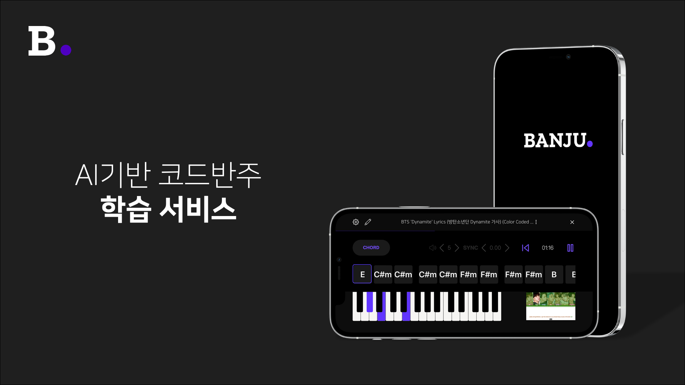

# :musical_keyboard: Banju
***AI기반 피아노 코드반주 학습 서비스***

> This project was bootstrapped with [react-native-cli](https://www.npmjs.com/package/react-native-cli) (2.0.1)

**Software Maestro 11기 TEAM forte 🎼김성환 유인성 김하균**

## 👀 Introduction
- “원하는 곡을 연주하기 위해서는 스케일, 코드 등 알아야 할 지식이 너무 많아 입문이 어렵다”
  
- “코드 반주를 통해 자신이 좋아하는 곡을 더욱 쉽게 연주할 수 있다면 누구나 피아노에 지속적인 흥미를 느낄 것이다.”

## 🔎 Main Feature
* [x] YouTube 영상 또는 사용자의 음원에서 자동으로 피아노 코드를 추출
* [x] App 내의 Note View, Chord View를 통해 코드 반주를 어떻게 연주해야 하는지 알려줌
* [x] 사용자의 연주를 분석하여 부족한 부분을 피드백해주고 다음 곡을 추천
* [x] 연습 트래킹을 통한 동기부여 요소 제공

## :computer: Techs
### Front-End
- React Native, RN Game-Engine
### Back-End
- Node.js, Express.js, Sequelize.js
### MIR-Engine
- PyTorch, TensorFlow Lite, CoreML, Kubernetes

## 🙌 Prerequisites (iOS)
### Please Refer to...
- [react-native-piano-sampler](https://www.npmjs.com/package/react-native-piano-sampler)
- [react-native-pitch-tracker](https://www.npmjs.com/package/react-native-pitch-tracker)

## 🔨 How to build
- `npm install`
- `npx pod-install ios` (if build in iOS)
- `react-native run-ios` OR `react-native run-android`
