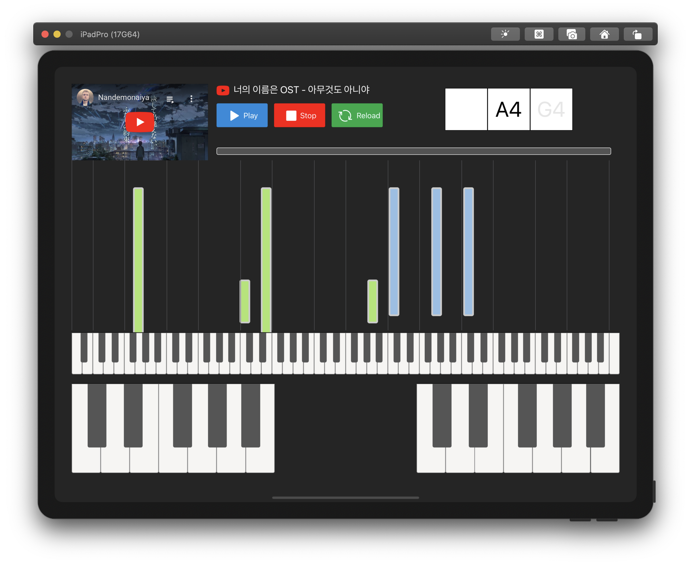

# :musical_keyboard: Banju
***AI기반 피아노 코드반주 학습 서비스***

> This project was bootstrapped with [react-native-cli](https://www.npmjs.com/package/react-native-cli) (2.0.1)

**Software Maestro 11기 TEAM forte 🎼김성환 유인성 김하균**

## 👀 Introduction
   - “원하는 곡을 연주하기 위해서는 스케일, 코드 등 알아야 할 지식이 너무 많아 입문이 어렵다”
  
- “본 서비스는 사용자가 원하는 곡의 코드반주를 App만을 통해 seamless하게 연습할 수 있는 환경을 제공하고자 한다.”

## 🔎 Main Feature
- YouTube 영상 및 wav 파일을 통한 코드(Chord) 추출 및 반주 생성
- 생성된 코드반주를 연습할 수 있는 User Interface
- 코드반주 정확도, 자주 틀리는 코드 및 스케일 등 여러 방면으로의 피드백
- 개인 연주 프로필 공유 및 연습 환경 공유

## :computer: Techs
### Front-End
- React Native, RN Game-Engine
### Back-End
- Node.js, Express.js, Sequelize.js
### MIR-Engine
- PyTorch, TensorFlow Lite (Python/Swift)

## 🔨 How to build (works on iOS only)
- `npm install`
- `npx pod-install ios`
- `react-native run-ios`

